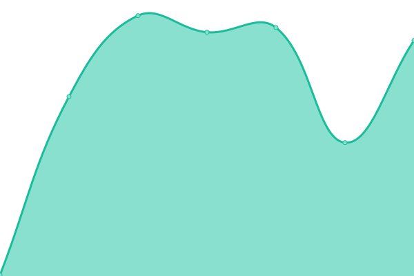
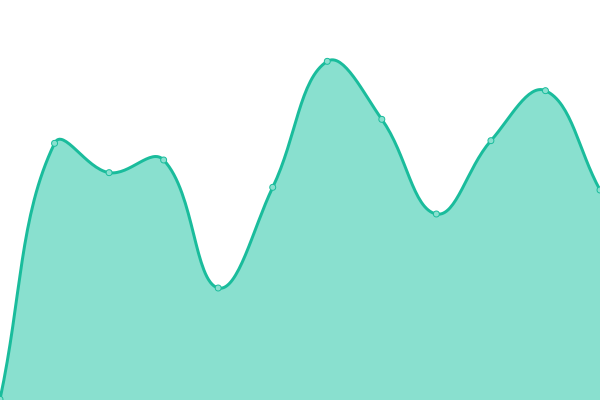
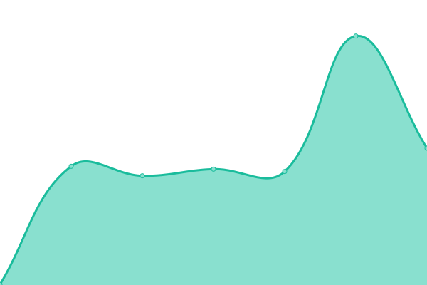

# [📈 Live Status](https://status.cincinnaticodes.com): <!--live status--> **🟧 Partial outage**

This repository contains the open-source uptime monitor and status page for [Chris Daniel](http://christopherdaniel.me), powered by [Upptime](https://github.com/upptime/upptime).

With [Upptime](https://upptime.js.org), you can get your own unlimited and free uptime monitor and status page, powered entirely by a GitHub repository. We use [Issues](https://github.com/cwdaniel/upptime-sites/issues) as incident reports, [Actions](https://github.com/cwdaniel/upptime-sites/actions) as uptime monitors, and [Pages](https://status.cincinnaticodes.com) for the status page.

<!--start: status pages-->
<!-- This summary is generated by Upptime (https://github.com/upptime/upptime) -->
<!-- Do not edit this manually, your changes will be overwritten -->
<!-- prettier-ignore -->
| URL | Status | History | Response Time | Uptime |
| --- | ------ | ------- | ------------- | ------ |
|  [GrowTales](https://growtalesai.com) | 🟩 Up | [grow-tales.yml](https://github.com/cwdaniel/upptime-sites/commits/HEAD/history/grow-tales.yml) | 

 253ms
     
 | 

<a href="https://cwdaniel.github.io/upptime-sites/history/grow-tales">97.25%</a>
    

|  [GrowTales API](https://api.growtalesai.com/graphql) | 🟥 Down | [grow-tales-api.yml](https://github.com/cwdaniel/upptime-sites/commits/HEAD/history/grow-tales-api.yml) | 

 232ms
     
 | 

<a href="https://cwdaniel.github.io/upptime-sites/history/grow-tales-api">0.00%</a>
    

|  [Cincinnati Codes](https://cincinnaticodes.com) | 🟩 Up | [cincinnati-codes.yml](https://github.com/cwdaniel/upptime-sites/commits/HEAD/history/cincinnati-codes.yml) | 

 357ms
     
 | 

<a href="https://cwdaniel.github.io/upptime-sites/history/cincinnati-codes">96.56%</a>
    

|  [Full Stack Code Ninja](https://fullstackcodeninja.com) | 🟩 Up | [full-stack-code-ninja.yml](https://github.com/cwdaniel/upptime-sites/commits/HEAD/history/full-stack-code-ninja.yml) | 

 324ms
     
 | 

<a href="https://cwdaniel.github.io/upptime-sites/history/full-stack-code-ninja">98.65%</a>
    

|  [GoQRly](https://goqrly.com) | 🟩 Up | [go-q-rly.yml](https://github.com/cwdaniel/upptime-sites/commits/HEAD/history/go-q-rly.yml) | 

 345ms
     
 | 

<a href="https://cwdaniel.github.io/upptime-sites/history/go-q-rly">37.98%</a>
    

|  [SnackVote](https://snackvote.com) | 🟩 Up | [snack-vote.yml](https://github.com/cwdaniel/upptime-sites/commits/HEAD/history/snack-vote.yml) | 

 366ms
     
 | 

<a href="https://cwdaniel.github.io/upptime-sites/history/snack-vote">98.65%</a>
    

|  [Vaulted Photos](https://vaultedphotos.com) | 🟥 Down | [vaulted-photos.yml](https://github.com/cwdaniel/upptime-sites/commits/HEAD/history/vaulted-photos.yml) | 

 297ms
     
 | 

<a href="https://cwdaniel.github.io/upptime-sites/history/vaulted-photos">0.00%</a>
    

|  [I Need Pokemon Cards](https://ineedpokemoncards.com) | 🟥 Down | [i-need-pokemon-cards.yml](https://github.com/cwdaniel/upptime-sites/commits/HEAD/history/i-need-pokemon-cards.yml) | 

 63ms
     
 | 

<a href="https://cwdaniel.github.io/upptime-sites/history/i-need-pokemon-cards">0.00%</a>
    

|  [Sanctuary Sight](https://sanctuarysight.com) | 🟩 Up | [sanctuary-sight.yml](https://github.com/cwdaniel/upptime-sites/commits/HEAD/history/sanctuary-sight.yml) | 

 363ms
     
 | 

<a href="https://cwdaniel.github.io/upptime-sites/history/sanctuary-sight">37.54%</a>
    

|  [Tatted Monkeys](https://tattedmonkeys.com) | 🟩 Up | [tatted-monkeys.yml](https://github.com/cwdaniel/upptime-sites/commits/HEAD/history/tatted-monkeys.yml) | 

 224ms
     
 | 

<a href="https://cwdaniel.github.io/upptime-sites/history/tatted-monkeys">97.91%</a>
    

|  [Tactical Warfare Protocol](https://tacticalwarfareprotocol.com) | 🟩 Up | [tactical-warfare-protocol.yml](https://github.com/cwdaniel/upptime-sites/commits/HEAD/history/tactical-warfare-protocol.yml) | 

 250ms
     
 | 

<a href="https://cwdaniel.github.io/upptime-sites/history/tactical-warfare-protocol">100.00%</a>
    

|  [TWP Mobile API](https://mobile-api.tacticalwarfareprotocol.com/graphql) | 🟩 Up | [twp-mobile-api.yml](https://github.com/cwdaniel/upptime-sites/commits/HEAD/history/twp-mobile-api.yml) | 

 257ms
     
 | 

<a href="https://cwdaniel.github.io/upptime-sites/history/twp-mobile-api">99.02%</a>
    

|  [TWP Admin](https://secure-admin.tacticalwarfareprotocol.com) | 🟩 Up | [twp-admin.yml](https://github.com/cwdaniel/upptime-sites/commits/HEAD/history/twp-admin.yml) | 

 239ms
     
 | 

<a href="https://cwdaniel.github.io/upptime-sites/history/twp-admin">100.00%</a>
    

<!--end: status pages-->

[**Visit our status website →**](https://status.cincinnaticodes.com)

## 📄 License

- Powered by: [Upptime](https://github.com/upptime/upptime)
- Code: [MIT](./LICENSE) © [Anand Chowdhary](https://anandchowdhary.com), supported by [Pabio](https://pabio.com)
- Data in the `./history` directory: [Open Database License](https://opendatacommons.org/licenses/odbl/1-0/)
